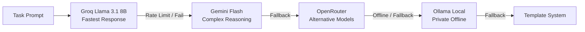

<div align="center">

# ⚡ JARVIS MK-X

### *Terminal-First Autonomous Engineering Agent*

[](https://python.org)
[](https://opensource.org/licenses/MIT)
[](https://github.com/astral-sh/ruff)

</div>

**JARVIS MK-X** is a terminal-native autonomous software-engineering agent. It runs a goal-driven agent loop in-process, routes across multiple local and hosted LLM providers with resilient fallback, and exposes a strict **single tool-execution boundary** so every tool call — from the agent loop or any external protocol (MCP, ACP, Codex) — passes through one permissioned, observable pipeline.

---

## 🔑 Highlights

- **Single tool boundary.** *All* tool execution flows through `ToolExecutionService`. Agent protocol adapters (MCP / ACP / Codex) and the loop itself delegate to it; there is no bypass path. Enforced by architecture-invariant tests.
- **Hardened agent loop.** ReAct-style goal loop with `OBSERVING → VERIFYING → RECOVERING → EXECUTING` state transitions, a post-execution verification gate, deterministic failure classification (`CANCELLED > TIMEOUT > PERMISSION_DENIED > …`), and **parallel execution of read-only tool calls** (bounded by `Policy.max_concurrent_actions`).
- **Multi-tier LLM routing.** Resilient provider chain across Groq, Google Gemini, OpenRouter, and local Ollama, with a `ModelGateway` that gates providers by capability and confidence.
- **Declarative tool system.** ~76 tools carry metadata — `risk`, `timeout_seconds`, `is_destructive`, `side_effects` — driving automatic classification, timeout enforcement, and security policy.
- **Goal-aware tool-hinting.** A curated core tool subset is offered to the model when no keyword intent matches, cutting token usage without dropping capabilities.
- **Multi-tier security.** Modes from strict read-only planning to full autonomy, opt-in risk gating for destructive tools, secret redaction, and sandboxed command execution.
- **Persistent memory.** SQLite + `sqlite-vec` vector store for long-term knowledge, facts, and developer preferences, plus a per-authority memory layer.
- **Rich terminal UI.** Live streaming telemetry, tool-result panels, a telemetry cockpit, and unified discoverable slash commands.

---

## 🚀 Quick Start

```bash
git clone https://github.com/Railgunonyx1/JARVIS.git
cd JARVIS

python -m venv venv
# Windows:
.\venv\Scripts\Activate.ps1
# Linux/macOS:
source venv/bin/activate

pip install -r requirements.txt
```

### Configure API Keys

Set provider keys in a `.env` file or environment variables:

```env
GROQ_API_KEY=gsk_...
GEMINI_API_KEY=AIza...
OPENROUTER_API_KEY=sk-or-...
```

*(Local Ollama offline models work without any API keys.)*

### Launch

```bash
# Interactive agent interface
.\venv\Scripts\python.exe -m cli

# One-shot task (returns JSON / NDJSON automatically)
.\venv\Scripts\python.exe -m cli "inspect repository structure and summarize findings"

# Fast (JSON) one-shot mode
.\venv\Scripts\python.exe -m cli.fast "explain the layout module"

# Windows launcher (Interactive, agent mode)
JARVIS.bat
```

---

## 🎛️ Execution Modes

| Mode | Flag | Description | Risk Profile |
| :--- | :--- | :--- | :--- |
| **Plan** | `--mode plan` | Generates plans without modifying files or running commands | 🟢 Read-Only |
| **Controlled** | `--mode controlled` | Requests confirmation before destructive tool calls | 🟡 High Oversight |
| **Smart** | `--mode smart` | Auto-executes reads; prompts for destructive changes | 🔵 Balanced |
| **Agent** | `--mode agent` | Fully autonomous goal-solving loop | 🟣 Full Autonomy |

```bash
.\venv\Scripts\python.exe -m cli --mode smart
```

---

## 💻 Interactive Slash Commands

Discover commands inside the terminal with `/help`. Core set:

```
  /help                  Help system and available commands
  /mode <name>           Switch mode (plan | controlled | smart | agent)
  /models                Inspect available models (sizes, speeds, strengths)
  /model status          Deep-dive on the active provider + token telemetry
  /status                System diagnostics and memory state
  /context               Token window usage and budget breakdown
  /tools                 List registered tools
  /skills                List skills
  /plugins               List plugins
  /providers             List configured providers
  /history               List previous tasks and goals
  /audit                 View the security action audit log
  /tree                  Render the project directory tree
  /cockpit               Open the diagnostic telemetry dashboard
  /clear                 Clear the terminal viewport
  /exit                  Quit session
```

---

## 🏗️ Architecture

```
USER / CLIENT -> INTENT ROUTER -> AGENT KERNEL -> HARNESS -> MODEL GATEWAY
    -> PROVIDER ROUTER -> MODEL -> TOOL EXECUTOR -> SANDBOX + PERMISSIONS
    -> OBSERVATION -> VERIFICATION -> BUS EVENT -> {TUI, Persistence, MCP, ACP}
```

```
JARVIS/
├── cli/                       # Terminal rendering, cockpit, slash commands
│   ├── main.py                # CLI entry point & interactive loop
│   ├── fast.py                # Fast (JSON/NDJSON) one-shot entry
│   ├── commands.py            # Unified slash-command dispatch
│   ├── renderer.py / layout.py / bridge.py / input.py / theme.py
│   └── cockpit.py             # Telemetry dashboard
│
├── core/agent/                # Autonomous agent kernel
│   ├── loop.py                # Goal-driven decision & execution loop
│   ├── tool_service.py        # SINGLE tool-execution boundary
│   ├── tools.py               # AgentToolExecutor
│   ├── permissions.py         # Permission engine + risk gating
│   ├── tool_verifier.py       # Post-tool result verification
│   ├── verification.py        # Verification engine (post-execution gate)
│   ├── state.py               # Agent state machine
│   ├── intent.py              # Zero-LLM intent routing & tool selection
│   ├── observer.py            # Event streams & observations
│   └── contexts.py, lanes.py, quality_evaluator.py, …
│
├── providers/                 # Multi-LLM engine
│   ├── router.py              # Resilient fallback routing chain
│   ├── model_gateway.py       # Capability/confidence model selection
│   ├── groq_provider.py / gemini_provider.py / openrouter_provider.py / ollama_provider.py
│   └── types.py               # LLMResponse, ToolCall, schema utilities
│
├── tools/                     # Declarative tool registry
│   ├── schema.py              # Tool metadata (risk, timeout, destructive, …)
│   ├── classification.py      # Automatic tool risk classification
│   ├── registry.py            # Tool catalog (~76 tools)
│   ├── shell.py, filesystem, search, browser, git, …
│   └── plugin_bridge.py       # Plugin -> tool bridging
│
├── runtime/protocols/         # External agent protocols (all route through the boundary)
│   ├── __init__.py            # MCP / ACP / Codex adapters
│   └── event_bus.py           # BusEvent pub/sub
│
├── memory/                    # SQLite + sqlite-vec persistence
├── security/                  # Policies, redaction, engine
├── config/modes/              # Per-mode tool + behavior policies
├── core/harness/              # Harness selector & presets
└── tests/                     # 570+ tests incl. architecture invariants
```

---

## 🛡️ Security Model

- **Single boundary**: every tool call — from the agent loop or MCP/ACP/Codex — goes through `ToolExecutionService` → `PermissionEngine` → executor → redaction.
- **Risk-aware**: tools carry `risk` / `is_destructive` metadata; modes and an opt-in risk gate restrict destructive tools.
- **Sandboxed execution** for shell commands; secrets **redacted** from all tool output (including parallel execution paths).
- **Audit trail**: every permission decision and tool execution emits structured `BusEvent`s with `schema_version` / `session_id`.
- **Verification gate**: after the execution phase, key actions (file writes, patches, commits) are verified against the filesystem/state; failures transition to recovery with structured context. Verified tool calls are marked `internal` so they don't pollute task observations.

---

## 🔄 Multi-Tiered LLM Routing



A `ModelGateway` sits in front of the providers, gating by capability (`Capability.CODING`, `Capability.TOOL_USE`, …) and confidence, with provider recovery on failure.

---

## 🧪 Testing & CI

```bash
# Lint
ruff check .

# Full test suite
pytest tests/ -q

# Architecture invariants (single-boundary enforcement)
pytest tests/test_architecture_invariants.py
```

The suite includes an AST-based static scan that fails the build if any code outside the owner files constructs an executor directly or bypasses the boundary, plus runtime delegation tests for the MCP / ACP / Codex adapters.

---

## 🤝 Contributing

See [CONTRIBUTING.md](CONTRIBUTING.md) and [CODE_OF_CONDUCT.md](CODE_OF_CONDUCT.md) for coding standards and PR workflows.

---

## 📄 License

MIT — see the [LICENSE](LICENSE) file.