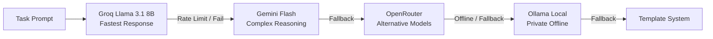

<div align="center">

# ⚡ JARVIS MK-X

### *Terminal-First Autonomous Engineering Agent*

[](https://github.com/Railgunonyx1/JARVIS/actions)
[](https://python.org)
[](https://opensource.org/licenses/MIT)
[](https://github.com/astral-sh/ruff)
[](#architecture)

<p align="center">
  <b>JARVIS MK-X</b> is a lightning-fast, terminal-native autonomous software engineering agent built for precision, local privacy, and zero-latency in-process execution.
</p>

[Quick Start](#-quick-start) •
[Key Features](#-key-features) •
[Execution Modes](#-execution-modes) •
[CLI Commands](#-cli-commands) •
[Architecture](#-architecture) •
[LLM Router](#-multi-tiered-llm-routing) •
[Contributing](#-contributing)

---

</div>

## 🌟 Highlights

- ⚡ **Low-Overhead In-Process Loop**: Runs directly inside your terminal process without heavy daemons or network hops.
- 🎨 **Rich UI & Live Telemetry**: Live updating terminal UI with streaming telemetry, plans, tool outputs, and status gauges.
- 🧠 **Multi-Provider Fallback Router**: Auto-falls back across Groq (Llama 3.1 8B), Google Gemini Flash, OpenRouter, and local Ollama.
- 🛡️ **Multi-Tier Autonomy & Safety**: 4 distinct execution modes ranging from strict read-only planning to full autonomous execution with interactive confirmations.
- 💾 **Persistent Categorized Memory**: SQLite & Vector store (`sqlite-vec`) for persistent long-term knowledge, facts, and developer preferences.
- 🔍 **Integrated Developer Tooling**: Built-in AST file analysis, regex grep, file modifications, sandboxed command execution, and performance benchmarks.

---

## 🚀 Quick Start

### 1. Installation

```bash
# Clone the repository
git clone https://github.com/Railgunonyx1/JARVIS.git
cd JARVIS

# Create and activate virtual environment
python -m venv venv
# On Windows:
.\venv\Scripts\Activate.ps1
# On Linux/macOS:
source venv/bin/activate

# Install dependencies
python -m pip install --upgrade pip
pip install -r requirements.txt
```

### 2. Configure API Keys

Set your preferred provider keys in environment variables or create a `.env` file:

```env
GROQ_API_KEY=gsk_...
GEMINI_API_KEY=AIza...
OPENROUTER_API_KEY=sk-or-...
```

*(Local Ollama offline models work without API keys!)*

### 3. Launch

```bash
# Launch interactive agent interface
python -m cli

# Or execute a one-shot task directly
python -m cli "inspect repository structure and summarize findings"
```

---

## 🎛️ Execution Modes

| Mode | Flag | Description | Risk Profile |
| :--- | :--- | :--- | :--- |
| **Plan** | `--mode plan` | Generates execution plans without modifying files or running commands | 🟢 Read-Only (Zero Risk) |
| **Controlled** | `--mode controlled` | Requests user confirmation before executing any tool or command | 🟡 High Oversight |
| **Smart** | `--mode smart` | Auto-executes read operations; prompts confirmation for destructive changes | 🔵 Balanced Autonomy |
| **Agent** | `--mode agent` | Fully autonomous goal solving loop with automatic tool execution | 🟣 Full Autonomy |

```bash
python -m cli --mode smart
```

---

## 💻 Interactive Terminal Commands

Inside the interactive terminal session, control JARVIS using fast built-in slash commands:

```
  /help                  Show help system and available commands
  /mode <name>           Switch active mode (plan | controlled | smart | agent)
  /model                 Inspect active LLM provider and token telemetry
  /status                Show system diagnostics and memory state
  /context               View token window usage and budget breakdown
  /memory search <q>     Search semantic memory
  /memory add <k>=<v>    Store a user preference or fact
  /history               List previous tasks and goals
  /audit                 View security action audit log
  /tree                  Render project directory tree
  /cockpit               Open diagnostic telemetry dashboard
  /clear                 Clear terminal viewport
  /exit                  Quit session
```

---

## 🏗️ Architecture

```
JARVIS MK-X
├── cli/                          # Terminal Rendering & UX
│   ├── main.py                   # CLI entry point & interactive loop
│   ├── renderer.py               # Rich UI layout & panels
│   ├── bridge.py                 # Agent event translation bridge
│   ├── input.py                  # Low-latency Windows msvcrt / POSIX input
│   └── cockpit.py                # Telemetry dashboard & analytics
│
├── core/agent/                   # Autonomous Agent Core
│   ├── loop.py                   # ReAct decision & execution loop
│   ├── observer.py               # Real-time event streams & hooks
│   └── event_store.py            # Event persistence
│
├── providers/                    # Multi-LLM Provider Engine
│   ├── router.py                 # Resilient fallback routing chain
│   ├── groq_provider.py          # Ultra-fast Groq Llama 3.1 8B
│   ├── gemini_provider.py        # Gemini Flash reasoning
│   ├── openrouter_provider.py    # OpenRouter API integration
│   └── ollama_provider.py        # Local offline Ollama provider
│
├── tools/                        # Safe Tool Registry
│   ├── filesystem/               # Scoped file read / write / patch
│   ├── grep/                     # Fast ripgrep / regex search
│   └── bash/                     # Command runner with security isolation
│
├── memory/                       # Knowledge & Persistence
│   ├── store.py                  # SQLite storage backend
│   └── vector_store.py           # sqlite-vec vector embeddings
│
└── benchmark/                    # Continuous Performance Gates
    ├── gate.py                   # Automated regression prevention
    └── baseline.json             # Ground truth performance metrics
```

---

## 🔄 Multi-Tiered LLM Routing

JARVIS MK-X employs a tiered fallback chain to guarantee high availability and sub-second responses:



---

## 🧪 Testing & CI

JARVIS MK-X includes a multi-tiered test suite and automated CI workflow:

```bash
# Run safety linter
ruff check . --select E9,F63,F7,F82

# Run full test suite
pytest tests/ -q

# Run benchmark performance gate
python -m benchmark.gate --baseline benchmark/baseline.json --ci
```

---

## 🤝 Contributing

Contributions are welcome! Please check out [CONTRIBUTING.md](CONTRIBUTING.md) and our [CODE_OF_CONDUCT.md](CODE_OF_CONDUCT.md) for details on getting started, coding standards, and PR workflows.

---

## 📄 License

This project is licensed under the MIT License — see the [LICENSE](LICENSE) file for details.