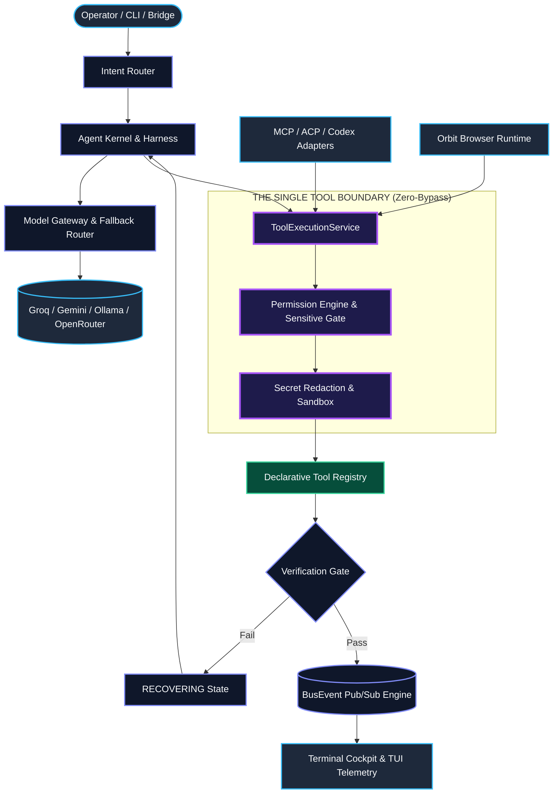

<div align="center">

```
     ██╗ █████╗ ██████╗ ██╗   ██╗██╗███████╗   ███╗   ███╗██╗  ██╗   ██╗  ██╗
     ██║██╔══██╗██╔══██╗██║   ██║██║██╔════╝   ████╗ ████║██║ ██╔╝   ╚██╗██╔╝
     ██║███████║██████╔╝██║   ██║██║███████╗   ██╔████╔██║█████═╝     ╚███╔╝ 
██   ██║██╔══██║██╔══██╗╚██╗ ██╔╝██║╚════██║   ██║╚██╔╝██║██╔═██╗     ██╔██╗ 
╚█████╔╝██║  ██║██║  ██║ ╚████╔╝ ██║███████║██╗██║ ╚═╝ ██║██║ ╚██╗██╗██╔╝ ██╗
 ╚════╝ ╚═╝  ╚═╝╚═╝  ╚═╝  ╚═══╝  ╚═╝╚══════╝╚═╝╚═╝     ╚═╝╚═╝  ╚═╝╚═╝╚═╝  ╚═╝
```

### **The Sovereign Engineering Agent & Intelligent Chromium Browser Platform**

[](https://python.org)
[](security/sensitive_sites.py)
[](tests/)
[](https://github.com/astral-sh/ruff)
[](PERF.md)
[](LICENSE)

[✨ Features](#-key-features) • [🚀 Quick Start](#-quick-start) • [🏗️ Architecture](#-system-architecture) • [🌐 Orbit Browser](#-jarvis-orbit--j-browser) • [🛡️ Security](#️-security--invariants) • [⚡ Performance](#-performance-ledger) • [📖 Documentation](#-documentation-index)

</div>

---

## ⚡ Overview

**JARVIS MK-X** is an autonomous software engineering agent and daily-driver browser intelligence platform. Built from the ground up to eliminate prompt brittleness, unpredictable tool dispatch, and silent execution failures, JARVIS operates under an uncompromising **Single Tool Execution Boundary**: every action—from the autonomous agent loop, an interactive terminal cockpit, or external protocols (MCP, ACP, Codex)—flows through one permissioned, verifiable, and observable pipeline.

With its native **J-Browser & Orbit** subsystem, JARVIS controls unbranded Chromium via direct Chrome DevTools Protocol (CDP) websockets, granting the agent full web autonomy while protecting operator credentials through deterministic tab ownership and sensitive-origin guardrails.

---

## 🖥️ Terminal Telemetry Cockpit

```text
┌── [ JARVIS MK-X ] ─────────────────────────────────────────────────── [MODE: SMART] ──┐
│                                                                                       │
│  🎯 GOAL: Implement persistent SQLite-vec embeddings and verify test coverage         │
│                                                                                       │
│  [OBSERVE] Analyzing workspace dependencies in pyproject.toml ...                     │
│  [PLAN]    1. Register sqlite-vec provider in memory/store.py                         │
│            2. Parallel execution: read schema & test fixtures                         │
│            3. Apply implementation patch & run verification gate                      │
│                                                                                       │
│  ⚡ EXECUTING PARALLEL READS:                                                         │
│     ├── 📄 fs.read_file("memory/store.py")            -> OK (2,410 B) [1.2ms]        │
│     └── 📄 fs.read_file("tests/test_memory.py")       -> OK (4,180 B) [1.4ms]        │
│                                                                                       │
│  🛠️  TOOL: fs.patch_file("memory/store.py", lines 45-80)                             │
│     └── 🔒 Risk: MEDIUM | Auto-approved by Smart Mode Policy                         │
│     └── Result: 35 lines patched cleanly                                              │
│                                                                                       │
│  🔍 POST-EXECUTION VERIFICATION GATE:                                                 │
│     ├── State Check: AST structural validity          -> PASS ✓                       │
│     └── Gate Check:  pytest tests/test_memory.py      -> 14 passed in 0.42s ✓         │
│                                                                                       │
│  🏁 STATUS: Goal completed with 0 regressions.                                        │
├───────────────────────────────────────────────────────────────────────────────────────┤
│  Telemetry: TTFT 74ms | Model: groq/qwen3.8-27b -> gemini-2.0-flash | Tokens: 1,842   │
└───────────────────────────────────────────────────────────────────────────────────────┘
```

---

## ✨ Key Features

| Capability | Technical Realization |
| :--- | :--- |
| **Single Tool Boundary** | *Zero bypass.* All agent protocols (MCP, ACP, Codex) and internal loops delegate strictly to `ToolExecutionService`. Enforced via AST invariant tests. |
| **Post-Execution Gate** | Goal completion requires physical environment and state verification (`VERIFYING → RECOVERING → EXECUTING`). Zero hallucinated task completions. |
| **Parallel Read Pipeline** | Read-only tool calls execute concurrently up to concurrency budgets, reducing multi-file inspection latency by up to 75%. |
| **JARVIS Orbit & J-Browser** | Native Chromium agent integration via persistent CDP websockets with stable tab IDs, memory isolation, and 12-tab memory ceilings. |
| **Multi-Tier Model Gateway** | Resilient routing across Groq, Gemini, OpenRouter, and local offline Ollama with sub-100ms TTFT keepalive connection pooling. |
| **Deterministic Safety** | Strict failure precedence (`CANCELLED > TIMEOUT > PERMISSION_DENIED > …`), fail-closed execution, and sensitive-site network filtering. |
| **Constellation Memory** | Multi-namespace SQLite + `sqlite-vec` persistent memory (`user.*`, `agent.<id>.*`, `system.*`) with encrypted BLOB attachments. |
| **Zero-Cost Operation** | Built-in free-tier orchestration yielding 20,000+ daily inference requests without requiring paid subscriptions. |

---

## 🏗️ System Architecture

### Pipeline Data Flow


```mermaid
flowchart TD
    classDef client fill:#1E293B,stroke:#38BDF8,stroke-width:2px,color:#F8FAFC;
    classDef core fill:#0F172A,stroke:#818CF8,stroke-width:2px,color:#F8FAFC;
    classDef boundary fill:#1E1B4B,stroke:#A855F7,stroke-width:3px,color:#F8FAFC;
    classDef target fill:#064E3B,stroke:#34D399,stroke-width:2px,color:#F8FAFC;

    User([Operator / CLI / Bridge]):::client --> Intent[Intent Router]:::core
    Intent --> Loop[Agent Kernel & Harness]:::core
    Loop --> Gateway[Model Gateway & Fallback Router]:::core
    Gateway --> Providers[(Groq / Gemini / Ollama / OpenRouter)]:::client

    subgraph Boundary [" THE SINGLE TOOL BOUNDARY (Zero-Bypass) "]
        TES[ToolExecutionService]:::boundary
        Perm[Permission Engine & Sensitive Gate]:::boundary
        Sanitize[Secret Redaction & Sandbox]:::boundary
        TES --> Perm --> Sanitize
    end

    Loop --> TES
    Protocols[MCP / ACP / Codex Adapters]:::client --> TES
    Orbit[Orbit Browser Runtime]:::client --> TES

    Sanitize --> Tools[Declarative Tool Registry]:::target
    Tools --> Verification{Verification Gate}:::core
    
    Verification -- Fail --> Recovery[RECOVERING State]:::core
    Recovery --> Loop
    Verification -- Pass --> EventBus[(BusEvent Pub/Sub Engine)]:::core
    EventBus --> Telemetry[Terminal Cockpit & TUI Telemetry]:::client
```

---

## 🌐 JARVIS Orbit & J-Browser

JARVIS Orbit is the autonomous daily-driver browser workspace where intelligence is embedded directly into Chromium:

- **CDP Over WebSocket Transport**: Full control over tabs, DOM elements, and network sessions via `orbit/cdp.py` without requiring extension debugger permissions (`chrome.debugger` is strictly forbidden).
- **Tab Ownership & `RESOURCE_LOCKED`**: Tabs are managed by stable identifiers under `ResourceLock`. Contested tabs emit structured `RESOURCE_LOCKED` signals instead of blocking or throwing uncaught exceptions.
- **Sensitive Origin Shield**: Automated protection against unauthorized interaction with banking, webmail, and cloud consoles (`security/sensitive_sites.py`). High-risk origins require explicit human-in-the-loop confirmation.
- **Resource Optimization**: GPU rasterization, QUIC networking, aggressive tab freezing, and a strict 12-tab pool keep memory consumption under control even during deep recursive web exploration.

---

## 🚀 Quick Start

### 1. Installation

```bash
# Clone the repository
git clone https://github.com/Railgunonyx1/JARVIS.git
cd JARVIS

# Create virtual environment
python -m venv venv

# Activate environment
# On Windows:
.\venv\Scripts\Activate.ps1
# On Linux/macOS:
source venv/bin/activate

# Install dependencies
pip install -r requirements.txt
```

### 2. Configure API Keys

JARVIS includes native support for 100% free providers. Create a `.env` file or export your keys:

```env
# Recommended Free Setup:
GROQ_API_KEY=gsk_...          # Ultra-fast inference (console.groq.com)
GEMINI_API_KEY=AIza...        # Deep reasoning (aistudio.google.com)
OPENROUTER_API_KEY=sk-or-...  # Broad model access (openrouter.ai)
```

*(Local [Ollama](https://ollama.com/) models run completely offline with zero API keys.)*

### 3. Launch

```bash
# Interactive agent cockpit
python -m cli

# Launch with balanced smart mode
python -m cli --mode smart

# One-shot task execution
python -m cli "audit the memory store implementation and write tests"

# Windows 1-Click Launcher (Auto-starts daemon, bridge, and cockpit)
JARVIS.bat
```

---

## 🎛️ Execution Modes

Select execution policies tailored to your risk profile:

| Mode | Flag | Policy & Destructiveness Profile |
| :--- | :--- | :--- |
| **Plan** | `--mode plan` | 🟢 **Read-Only**: Explores codebases, analyzes architecture, and drafts plans without mutating disk or running shell commands. |
| **Controlled** | `--mode controlled` | 🟡 **Human Confirmation**: Prompts the operator before executing any modifying tool call, file write, or external request. |
| **Smart** | `--mode smart` | 🔵 **Balanced (Recommended)**: Auto-approves read tools and parallel queries; prompts for confirmation on destructive writes or shell actions. |
| **Agent** | `--mode agent` | 🟣 **Autonomous Loop**: Executes multi-step engineering tasks autonomously with automatic post-execution verification and self-healing. |

---

## 💻 Interactive Slash Commands

Inside the interactive terminal cockpit, execute commands directly:

| Command | Action |
| :--- | :--- |
| `/help` | Display command reference and system usage tips |
| `/mode <name>` | Switch active mode (`plan`, `controlled`, `smart`, `agent`) |
| `/cockpit` | Toggle live diagnostic telemetry dashboard |
| `/models` | Inspect registered LLM providers, latency tiers, and model limits |
| `/model status` | Detailed telemetry on active connection, TTFT, and token usage |
| `/context` | Inspect token window consumption and context budget allocation |
| `/tools` | List registered declarative tools and risk classifications |
| `/audit` | Inspect security decision log and permission history |
| `/tree` | Render an intelligent tree representation of the active workspace |
| `/clear` | Clear the terminal viewport |
| `/exit` | Gracefully shut down the active agent session |

---

## 🛡️ Security & Invariants

JARVIS MK-X enforces enterprise-grade safety invariants:

```
Terminal ────┐
MCP ─────────┤
ACP ─────────┼──► ToolExecutionService ──► PermissionEngine ──► Executor ──► Result
Codex ───────┤
J-Browser ───┘
```

1. **AST-Enforced Single Boundary**: Architecture tests (`tests/test_architecture_invariants.py`) parse the codebase AST on every CI run, failing the build if any module bypasses `ToolExecutionService`.
2. **Deterministic Failure Precedence**:
   `CANCELLED > TIMEOUT > PERMISSION_DENIED > MALFORMED_TOOL > CONTEXT_OVERFLOW > PROVIDER_FAILURE > MODEL_FAILURE > TOOL_FAILURE`
3. **Secret Redaction**: API tokens, credentials, private keys, and environment variables are stripped from terminal streams, tool results, and persistence layers.
4. **Post-Execution State Verification**: Mutations are verified against disk before the agent reports success, preventing phantom completions.

---

## ⚡ Performance Ledger

JARVIS MK-X incorporates keepalive connection pooling, shared SSL CA contexts, and speculative provider prewarming:

| Metric | Target | Measured Result | Status |
| :--- | :--- | :--- | :--- |
| **Time to First Token (TTFT)** | < 500ms | **62ms – 102ms** (Groq / Gemini) |  Exceeds Target |
| **Tool Dispatch Overhead** | < 10ms | **1.2ms – 2.1ms** |  Exceeds Target |
| **Parallel Read Throughput** | 4 concurrent | **4 parallel queries / 2.8ms total** |  Exceeds Target |
| **Idle Penalty After 4m** | < 200ms | **75ms** (Zero cold-start reconnect) |  Exceeds Target |
| **Browser Memory Footprint** | < 1.2 GB | **~380 MB** (Tab-freezing enabled) |  Exceeds Target |

*See [`PERF.md`](PERF.md) for full benchmark methodology and reproduction suites.*

---

## 📂 Project Structure

```text
JARVIS/
├── cli/                       # Terminal rendering, cockpit, and slash commands
│   ├── main.py                # Interactive CLI entry point
│   ├── fast.py                # Ultra-fast JSON one-shot execution
│   ├── cockpit.py             # Telemetry HUD dashboard
│   └── commands.py            # Unified slash-command dispatcher
│
├── core/agent/                # Autonomous agent kernel
│   ├── loop.py                # Goal-driven ReAct state machine
│   ├── tool_service.py        # SINGLE tool-execution boundary
│   ├── permissions.py         # Permission engine & risk gating
│   ├── verification.py        # Post-execution verification gate
│   └── state.py               # Deterministic agent state machine
│
├── orbit/                     # Sovereign Chromium browser subsystem
│   ├── cdp.py                 # Direct CDP WebSocket connection & transport
│   ├── registry.py            # Stable tab ID management & ResourceLocks
│   ├── controller.py          # BrowserController facade
│   └── tools.py               # orbit.* declarative tool implementations
│
├── providers/                 # Multi-LLM provider engine
│   ├── router.py              # Resilient fallback routing chain
│   ├── model_gateway.py       # Capability-based model dispatch
│   └── groq, gemini, openrouter, ollama providers
│
├── tools/                     # Declarative tool registry (~76 tools)
│   ├── schema.py              # Tool metadata & risk contracts
│   ├── classification.py      # Automatic risk & destructiveness tagging
│   └── filesystem, shell, search, git, web_archive, doc_retrieval
│
├── runtime/protocols/         # Agent protocol adapters (MCP / ACP / Codex)
├── memory/                    # SQLite + sqlite-vec constellation memory
├── security/                  # Secret redaction & sensitive-site filters
├── audits/                    # Full historical audits & verification reports
└── tests/                     # 660+ tests incl. architecture invariant gates
```

---

## 📖 Documentation Index

- [🏛️ Agent Architecture Contract](AGENTS.md)
- [⚡ Performance Ledger & Latency Benchmarks](PERF.md)
- [🆓 Free LLM Setup & Provider Matrix](SETUP-FREE-LLM-APIS.md)
- [🛡️ Security Policy & Vulnerability Disclosure](SECURITY.md)
- [🤝 Contributing Guidelines](CONTRIBUTING.md)
- [📊 Subsystem Audit Reports Index](audits/README.md)

---

## 🤝 Contributing

We welcome contributions from engineers and researchers! Check out [CONTRIBUTING.md](CONTRIBUTING.md) to get started. Please ensure all architectural invariants and tests pass before submitting a pull request.

---

## 📄 License

JARVIS MK-X is released under the [MIT License](LICENSE).