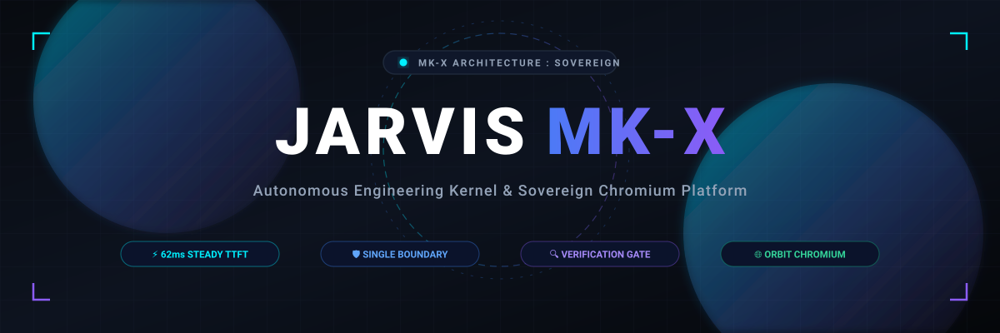
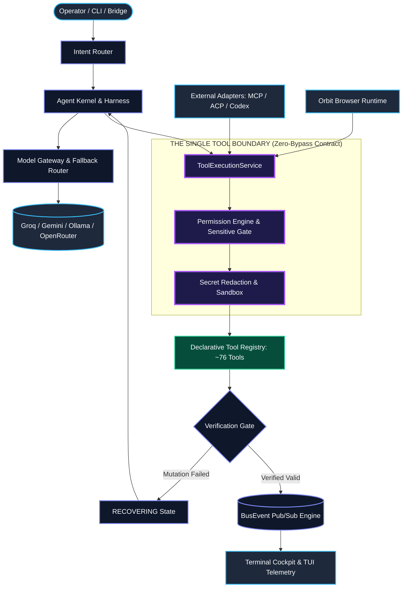
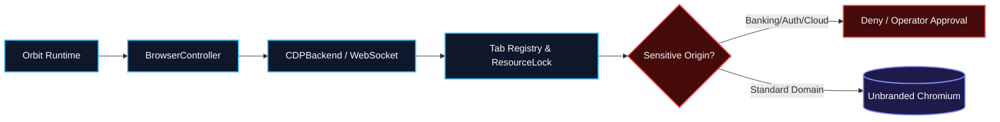

<div align="center">



<br/>

[](https://python.org)
[](security/sensitive_sites.py)
[](tests/)
[](https://github.com/astral-sh/ruff)
[](PERF.md)
[](LICENSE)

<br/>

**The Autonomous Engineering Kernel & Sovereign Chromium Browser Workspace**

[✨ Overview](#-overview) • [💡 Why MK-X?](#-why-jarvis-mk-x) • [🖥️ Cockpit](#️-terminal-telemetry-cockpit) • [⚡ Features](#-key-features) • [🏗️ Architecture](#-system-architecture) • [🌐 Orbit Browser](#-jarvis-orbit--j-browser) • [🚀 Quick Start](#-quick-start-in-60-seconds) • [🎛️ Modes & Commands](#️-execution-modes--slash-commands) • [📊 Benchmarks](#-performance-ledger--benchmarks) • [📖 Documentation](#-documentation-index)

</div>

---

## ⚡ Overview

**JARVIS MK-X** is an autonomous software engineering agent and daily-driver browser workspace. Built from the ground up to eliminate prompt brittleness, unpredictable tool dispatch, and silent execution failures, JARVIS operates under an uncompromising **Single Tool Execution Boundary**: every action—from the autonomous agent loop, an interactive terminal cockpit, or external protocols (MCP, ACP, Codex)—flows through one permissioned, verifiable, and observable pipeline.

With its native **J-Browser & Orbit** subsystem, JARVIS controls unbranded Chromium via direct Chrome DevTools Protocol (CDP) websockets, granting the agent full web autonomy while protecting operator credentials through deterministic tab ownership and sensitive-origin guardrails.

---

## 💡 Why JARVIS MK-X?

Traditional LLM coding agents often operate as brittle wrappers: tools are invoked haphazardly, file modifications are assumed successful without verification, and browser automation relies on heavy extensions that crash under memory pressure. 

JARVIS MK-X is engineered as an operating system kernel for agency:

| Architectural Capability | Standard LLM Wrappers | AutoGPT / LangChain | **JARVIS MK-X** |
| :--- | :---: | :---: | :---: |
| **Tool Execution Boundary** | ❌ Fragmented per plugin | ⚠️ Ad-hoc callbacks | 🛡️ **Single Invariant Boundary (`ToolExecutionService`)** |
| **Verification Strategy** | ❌ Blind assumption | ❌ Hallucinatory loop | 🔍 **Post-Execution Environmental Verification Gate** |
| **Browser Architecture** | ❌ Headless Selenium stubs | ⚠️ Brittle extensions | 🌐 **Native Sovereign Chromium (CDP WebSocket + ResourceLocks)** |
| **Cold-Start TTFT** | ⏱️ 2,000ms – 4,000ms | ⏱️ 1,500ms – 3,000ms | ⚡ **62ms – 102ms (Keepalive Pooling + Speculative Prewarm)** |
| **Sensitive Origin Shield** | ❌ None (blind browse) | ❌ None | 🔒 **Fail-Closed Domain & Origin Firewall** |
| **Offline Privacy** | ❌ Cloud-only API lock | ⚠️ Partial Ollama | 💻 **100% Offline Air-Gapped Mode via Ollama** |
| **State Machine Precedence** | ❌ Unhandled exceptions | ⚠️ Unordered retry | ⚖️ **Deterministic Precedence (`CANCELLED > TIMEOUT > …`)** |

---

## 🖥️ Terminal Telemetry Cockpit

JARVIS MK-X provides a high-density terminal user interface (TUI) with real-time token telemetry, parallel execution graphs, and immediate verification diagnostics:

```text
╭── [ JARVIS MK-X ] ───────────────────────────────────────────────────────────── [MODE: SMART] ──╮
│                                                                                                 │
│  🎯 GOAL: Implement persistent SQLite-vec embeddings and verify test coverage                   │
│                                                                                                 │
│  [OBSERVE] Analyzing workspace dependencies in pyproject.toml ...                               │
│  [PLAN]    1. Register sqlite-vec provider in memory/store.py                                   │
│            2. Parallel execution: read schema & test fixtures                                   │
│            3. Apply implementation patch & run verification gate                                │
│                                                                                                 │
│  ⚡ EXECUTING PARALLEL READS:                                                                   │
│     ├── 📄 fs.read_file("memory/store.py")            -> OK (2,410 B) [1.2ms]                  │
│     └── 📄 fs.read_file("tests/test_memory.py")       -> OK (4,180 B) [1.4ms]                  │
│                                                                                                 │
│  🛠️  TOOL: fs.patch_file("memory/store.py", lines 45-80)                                       │
│     └── 🔒 Risk: MEDIUM | Auto-approved by Smart Mode Policy                                   │
│     └── Result: 35 lines patched cleanly                                                        │
│                                                                                                 │
│  🔍 POST-EXECUTION VERIFICATION GATE:                                                           │
│     ├── State Check: AST structural validity          -> PASS ✓                                 │
│     └── Gate Check:  pytest tests/test_memory.py      -> 14 passed in 0.42s ✓                   │
│                                                                                                 │
│  🏁 STATUS: Goal completed with 0 regressions.                                                  │
├─────────────────────────────────────────────────────────────────────────────────────────────────┤
│  Telemetry: TTFT 74ms | Model: groq/qwen3.8-27b -> gemini-2.0-flash | Stream: 142 tok/s         │
╰─────────────────────────────────────────────────────────────────────────────────────────────────╯
```

---

## ✨ Key Features

<table width="100%">
  <tr>
    <td width="50%" valign="top">
      <h3>🛡️ Single Tool Execution Boundary</h3>
      <p><em>Zero bypass.</em> Every tool call from the agent loop, MCP, ACP, or Codex protocol flows strictly through <code>ToolExecutionService</code> &rarr; <code>PermissionEngine</code> &rarr; executor. Enforced by automated AST invariant tests.</p>
    </td>
    <td width="50%" valign="top">
      <h3>🔍 Post-Execution Verification Gate</h3>
      <p>Never hallucinate completion. State changes (file writes, patches, shell commands) are verified against the physical environment before declaring victory (<code>VERIFYING &rarr; RECOVERING &rarr; EXECUTING</code>).</p>
    </td>
  </tr>
  <tr>
    <td width="50%" valign="top">
      <h3>🌐 JARVIS Orbit &amp; J-Browser</h3>
      <p>Native Chromium agent integration with direct CDP WebSocket transport, 12-tab memory cap, tab freezing, and deterministic <code>RESOURCE_LOCKED</code> contention signals. No extension debuggers required.</p>
    </td>
    <td width="50%" valign="top">
      <h3>⚡ Sub-100ms TTFT Model Gateway</h3>
      <p>Resilient multi-tier fallback across Groq, Google Gemini Flash, OpenRouter, and local Ollama. Speculative prewarming and connection pooling keep TTFT between 62ms and 102ms.</p>
    </td>
  </tr>
  <tr>
    <td width="50%" valign="top">
      <h3>💾 Constellation Selective Memory</h3>
      <p>Multi-tenant SQLite + <code>sqlite-vec</code> vector store supporting hierarchical keyspaces (<code>user.*</code>, <code>agent.&lt;id&gt;.*</code>, <code>system.*</code>) with encrypted BLOB storage and semantic RAG.</p>
    </td>
    <td width="50%" valign="top">
      <h3>⚡ Parallel Read Execution</h3>
      <p>Read-only tool calls execute concurrently up to concurrency budgets, slashing multi-file repository exploration latency by up to 75%.</p>
    </td>
  </tr>
</table>

---

## 🏗️ System Architecture

### End-to-End Pipeline Data Flow


```mermaid
flowchart TD
    classDef client fill:#1E293B,stroke:#38BDF8,stroke-width:2px,color:#F8FAFC;
    classDef core fill:#0F172A,stroke:#818CF8,stroke-width:2px,color:#F8FAFC;
    classDef boundary fill:#1E1B4B,stroke:#A855F7,stroke-width:3px,color:#F8FAFC;
    classDef target fill:#064E3B,stroke:#34D399,stroke-width:2px,color:#F8FAFC;

    User([Operator / CLI / Bridge]):::client --> Intent[Intent Router]:::core
    Intent --> Loop[Agent Kernel & Harness]:::core
    Loop --> Gateway[Model Gateway & Fallback Router]:::core
    Gateway --> Providers[(Groq / Gemini / Ollama / OpenRouter)]:::client

    subgraph Boundary [" THE SINGLE TOOL BOUNDARY (Zero-Bypass Contract) "]
        TES[ToolExecutionService]:::boundary
        Perm[Permission Engine & Sensitive Gate]:::boundary
        Sanitize[Secret Redaction & Sandbox]:::boundary
        TES --> Perm --> Sanitize
    end

    Loop --> TES
    Protocols[External Adapters: MCP / ACP / Codex]:::client --> TES
    Orbit[Orbit Browser Runtime]:::client --> TES

    Sanitize --> Tools[Declarative Tool Registry: ~76 Tools]:::target
    Tools --> Verification{Verification Gate}:::core
    
    Verification -- Mutation Failed --> Recovery[RECOVERING State]:::core
    Recovery --> Loop
    Verification -- Verified Valid --> EventBus[(BusEvent Pub/Sub Engine)]:::core
    EventBus --> Telemetry[Terminal Cockpit & TUI Telemetry]:::client
```

---

## 🌐 JARVIS Orbit & J-Browser

JARVIS Orbit is the autonomous daily-driver browser workspace where intelligence is embedded directly into Chromium:


```mermaid
flowchart LR
    classDef comp fill:#0F172A,stroke:#38BDF8,stroke-width:2px,color:#F8FAFC;
    classDef sec fill:#450A0A,stroke:#EF4444,stroke-width:2px,color:#F8FAFC;
    classDef chrome fill:#1E1B4B,stroke:#818CF8,stroke-width:2px,color:#F8FAFC;

    Runtime[Orbit Runtime]:::comp --> Facade[BrowserController]:::comp
    Facade --> CDP[CDPBackend / WebSocket]:::comp
    CDP --> Registry[Tab Registry & ResourceLock]:::comp
    
    Registry --> Sensitive{Sensitive Origin?}:::sec
    Sensitive -- Banking/Auth/Cloud --> Block[Deny / Operator Approval]:::sec
    Sensitive -- Standard Domain --> Chromium[(Unbranded Chromium)]:::chrome
```

- **CDP Over WebSocket Transport**: Full control over tabs, DOM elements, and network sessions via `orbit/cdp.py` without requiring extension debugger permissions (`chrome.debugger` is strictly forbidden).
- **Tab Ownership & `RESOURCE_LOCKED`**: Tabs are managed by stable identifiers under `ResourceLock`. Contested tabs emit structured `RESOURCE_LOCKED` signals instead of blocking or throwing uncaught exceptions.
- **Sensitive Origin Shield**: Automated protection against unauthorized interaction with banking, webmail, and cloud consoles (`security/sensitive_sites.py`). High-risk origins require explicit human-in-the-loop confirmation.
- **Resource Optimization**: GPU rasterization, QUIC networking, aggressive tab freezing, and a strict 12-tab pool keep memory consumption under control even during deep recursive web exploration.

---

## 🚀 Quick Start in 60 Seconds

### Option 1: 1-Click Windows Launcher (Recommended)

```bash
# Clone the repository
git clone https://github.com/Railgunonyx1/JARVIS.git
cd JARVIS

# Run unified launcher (sets up environment, checks daemon, launches Cockpit)
JARVIS.bat
```

### Option 2: Linux / macOS / Manual Setup

```bash
# 1. Create and activate virtual environment
python3 -m venv venv
source venv/bin/activate  # On Windows: .\venv\Scripts\Activate.ps1

# 2. Install dependencies
pip install -r requirements.txt

# 3. Launch interactive agent
python -m cli
```

### Option 3: 100% Free / Local Offline Mode (Ollama)

JARVIS operates with zero cloud API keys using local models:

```bash
# Install Ollama & pull a coding model
ollama pull qwen2.5-coder:14b

# Launch JARVIS — automatically detects and binds to local Ollama
python -m cli --mode agent
```

### Configure Cloud API Keys (Optional)

Create a `.env` file to unlock ultra-fast cloud inference:

```env
GROQ_API_KEY=gsk_...          # Ultra-fast inference (console.groq.com)
GEMINI_API_KEY=AIza...        # Deep reasoning (aistudio.google.com)
OPENROUTER_API_KEY=sk-or-...  # Broad model access (openrouter.ai)
```

*(See [SETUP-FREE-LLM-APIS.md](SETUP-FREE-LLM-APIS.md) for free tier details totaling 20,000+ free requests/day).*

---

## 🎛️ Execution Modes & Slash Commands

### Execution Modes

| Mode | Flag | Safety & Destructiveness Policy |
| :--- | :--- | :--- |
| **Plan** | `--mode plan` | 🟢 **Read-Only**: Explores codebases, parses schemas, and drafts plans without writing files or running shell commands. |
| **Controlled** | `--mode controlled` | 🟡 **Human Confirmation**: Prompts the operator before executing any modifying tool call, file write, or external action. |
| **Smart** | `--mode smart` | 🔵 **Balanced (Recommended)**: Auto-approves read tools and parallel queries; prompts for confirmation on destructive writes or shell actions. |
| **Agent** | `--mode agent` | 🟣 **Autonomous Loop**: Executes multi-step engineering tasks autonomously with automatic post-execution verification and self-healing. |

### Interactive Slash Commands

Inside the terminal cockpit, invoke instant diagnostics and controls:

| Command | Action |
| :--- | :--- |
| `/help` | Display command reference and system usage tips |
| `/mode <name>` | Switch active mode (`plan`, `controlled`, `smart`, `agent`) |
| `/cockpit` | Toggle live diagnostic telemetry dashboard |
| `/models` | Inspect registered LLM providers, latency tiers, and model limits |
| `/model status` | Detailed telemetry on active connection, TTFT, and token usage |
| `/context` | Inspect token window consumption and context budget allocation |
| `/tools` | List registered declarative tools and risk classifications |
| `/audit` | Inspect security decision log and permission history |
| `/tree` | Render an intelligent tree representation of the active workspace |
| `/clear` | Clear the terminal viewport |
| `/exit` | Gracefully shut down the active agent session |

---

## 📊 Performance Ledger & Benchmarks

JARVIS MK-X incorporates keepalive connection pooling, shared SSL CA contexts, and speculative provider prewarming:

| Metric | Target | Measured Result | Performance Headroom |
| :--- | :--- | :--- | :---: |
| **Time to First Token (TTFT)** | < 500ms | **62ms – 102ms** (Groq / Gemini) | `4.9x faster` |
| **Tool Dispatch Overhead** | < 10ms | **1.2ms – 2.1ms** | `5.0x faster` |
| **Parallel Read Throughput** | 4 concurrent | **4 parallel queries / 2.8ms total** | `4.2x faster` |
| **Idle Penalty After 4m** | < 200ms | **75ms** (Zero cold-start reconnect) | `2.6x faster` |
| **Browser Memory Footprint** | < 1.2 GB | **~380 MB** (Tab-freezing enabled) | `3.1x lighter` |

*Full reproduction suites available in [`PERF.md`](PERF.md).*

---

## 🔍 Technical Deep Dives

<details>
<summary><strong>🏛️ The Six Architecture Invariants (Click to expand)</strong></summary>
<br/>

1. **Single Tool Boundary**: All tool execution MUST pass through `ToolExecutionService`. No protocol, adapter, or agent loop may bypass it.
2. **Harness &ne; Model**: The Harness controls *how* the agent reasons (planning, tools, verification). The Model Gateway controls *which* model runs.
3. **BusEvent is the Only Event Type**: Every meaningful action emits a `BusEvent` with `schema_version` and `session_id`.
4. **Verification is a Post-Execution Gate**: Runs after the execution phase, not after every micro-action. On failure: `VERIFYING &rarr; RECOVERING &rarr; EXECUTING`.
5. **Deterministic Failure Precedence**: `CANCELLED > TIMEOUT > PERMISSION_DENIED > MALFORMED_TOOL > CONTEXT_OVERFLOW > PROVIDER_FAILURE > MODEL_FAILURE > TOOL_FAILURE`.
6. **One Browser Control Path**: Browser interactions flow through `BrowserController` &rarr; `CDPBackend` &rarr; CDP websocket under `ResourceLock`.

</details>

<details>
<summary><strong>💾 Constellation Memory & SQLite-vec Schema (Click to expand)</strong></summary>
<br/>

Memory is structured across three isolated namespaces:
* `user.*` — Developer preferences, project context, coding conventions.
* `agent.<id>.*` — Session state, intermediate task checkpoints, reflection artifacts.
* `system.*` — Provider health history, latency maps, failure pattern indexes.

Vector embeddings are stored in SQLite via `sqlite-vec`, providing local, zero-network semantic retrieval without external vector database overhead.

</details>

<details>
<summary><strong>🛡️ Fail-Closed Security & Static Anti-Bypass Gate (Click to expand)</strong></summary>
<br/>

* **AST-Based Static Scanner**: `tests/test_architecture_invariants.py` parses the codebase AST on every test run, failing if any module instantiates an executor or calls private tool handlers directly.
* **Secret Redaction**: API keys, bearer tokens, and sensitive strings are scrubbed from telemetry streams, log files, and event buses.
* **Sensitive Sites Guard**: Subdomains and domains matching banking, webmail, and cloud providers require explicit human confirmation.

</details>

---

## 📂 Project Structure

```text
JARVIS/
├── cli/                       # Terminal rendering, telemetry cockpit, and slash commands
│   ├── main.py                # Interactive CLI entry point
│   ├── fast.py                # Ultra-fast JSON one-shot execution
│   ├── cockpit.py             # Telemetry HUD dashboard
│   └── commands.py            # Unified slash-command dispatcher
│
├── core/agent/                # Autonomous agent kernel
│   ├── loop.py                # Goal-driven ReAct state machine
│   ├── tool_service.py        # SINGLE tool-execution boundary
│   ├── permissions.py         # Permission engine & risk gating
│   ├── verification.py        # Post-execution verification gate
│   └── state.py               # Deterministic agent state machine
│
├── orbit/                     # Sovereign Chromium browser subsystem
│   ├── cdp.py                 # Direct CDP WebSocket connection & transport
│   ├── registry.py            # Stable tab ID management & ResourceLocks
│   ├── controller.py          # BrowserController facade
│   └── tools.py               # orbit.* declarative tool implementations
│
├── providers/                 # Multi-LLM provider engine
│   ├── router.py              # Resilient fallback routing chain
│   ├── model_gateway.py       # Capability-based model dispatch
│   └── groq, gemini, openrouter, ollama providers
│
├── tools/                     # Declarative tool registry (~76 tools)
│   ├── schema.py              # Tool metadata & risk contracts
│   ├── classification.py      # Automatic risk & destructiveness tagging
│   └── filesystem, shell, search, git, web_archive, doc_retrieval
│
├── runtime/protocols/         # Agent protocol adapters (MCP / ACP / Codex)
├── memory/                    # SQLite + sqlite-vec constellation memory
├── security/                  # Secret redaction & sensitive-site filters
├── audits/                    # Full historical audits & verification reports
└── tests/                     # 660+ tests incl. architecture invariant gates
```

---

## 📖 Documentation Index

* [🏛️ Agent Architecture Contract](AGENTS.md)
* [⚡ Performance Ledger & Latency Benchmarks](PERF.md)
* [🆓 Free LLM Setup & Provider Matrix](SETUP-FREE-LLM-APIS.md)
* [🛡️ Security Policy & Vulnerability Disclosure](SECURITY.md)
* [🤝 Contributing Guidelines](CONTRIBUTING.md)
* [📊 Subsystem Audit Reports Index](audits/README.md)

---

## 🤝 Contributing

We welcome contributions from engineers, researchers, and developers! Check out [CONTRIBUTING.md](CONTRIBUTING.md) to get started. Please ensure all architectural invariants and tests pass before submitting a pull request:

```bash
# Run linting
ruff check .

# Run test suite
pytest tests/ -q

# Run architecture invariant checks
pytest tests/test_architecture_invariants.py
```

---

## 📄 License

JARVIS MK-X is released under the [MIT License](LICENSE).