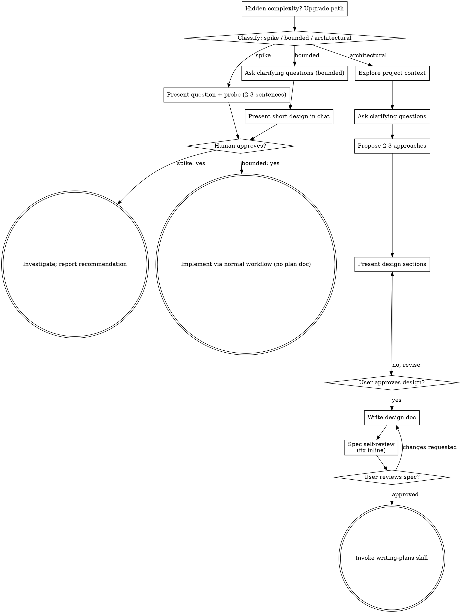

# Brainstorming Ideas Into Designs

Help turn ideas into fully formed designs and specs through natural collaborative dialogue.

Start by classifying how much process the request needs, then work
through your path: understand the context, refine the idea, present a
design, and get your human partner's approval.

<HARD-GATE>
Do NOT invoke any implementation skill, write any code, scaffold any
project, or take any implementation action until you have told your
human partner what you intend and they have approved it. This applies
to EVERY task on EVERY path below — the ceremony scales with the task;
the approval gate never does.
</HARD-GATE>

## Three Paths

Before your first question, classify the request and say the
classification out loud — "this looks bounded, so I'll present a short
design here rather than write a spec" — so your human partner can
override it:

- **Spike** — a feasibility question ("can we...", "is it possible...",
  "quick and dirty is fine") whose output is an answer, not code you
  keep. Present the question and what you'll try in 2-3 sentences, get
  a nod, then find out as cheaply as correctness allows. No design
  doc, no spec file. Report findings as a recommendation; anything you
  built stays labeled throwaway.
- **Bounded** — a well-scoped change to code that already exists in
  this repo: a new flag, a small endpoint, a one-file fix.
  Understanding the kind of app is not enough — bounded means the flow
  you are changing is already here to read. If there is no existing
  flow to change, the task is not bounded. Ask the clarifying
  questions that matter, present a short design IN CHAT (a few
  sentences to a few short paragraphs), and STOP. Implementation
  starts only after your human partner says yes to that design — a
  bounded task's approval is as hard a gate as an architectural
  one. No spec file, no implementation plan document.
- **Architectural** — new projects, new subsystems, changes that
  restructure how components fit together or alter interfaces others
  depend on. Follow the full process: questions, approaches, sectioned
  design, written spec, then the writing-plans skill.

When in doubt between two paths, take the heavier one. The ratchet is
one-way: hidden complexity discovered mid-task upgrades the path —
stop, say so, and step up. Nothing downgrades mid-task.

## Anti-Pattern: "Too Simple To Need Approval"

Every path ends with your human partner approving your intent before
implementation. A todo list, a single-function utility, a config
change — the design may be two sentences in chat, but you MUST present
it and get approval. "Simple" tasks are where unexamined assumptions
cause the most wasted work. What scales with simplicity is the
artifact, never the approval.

## Red Flags

| Thought | Reality |
|---------|---------|
| "This is too simple to need a design" | Simple means a short design, not no design. Two sentences in chat, then approval. |
| "I'll call it bounded and skip the spec" | Reaching for a label to skip work IS the doubt — take the heavier path. |
| "It's bounded and the design is obvious — I'll start while they read it" | The gate is the approval, not the design's length. Present, then stop until you hear yes. |
| "I understand this kind of app, so it's bounded" | Bounded measures the repo, not your familiarity. A new project has no existing flow — it is architectural. |
| "The spike works, so I'll keep the code" | A spike's output is an answer. Keeping the code is a new request — classify it. |
| "It grew, but I'm almost done — no need to re-classify" | Hidden complexity upgrades the path mid-task. Stop and say so. |
| "They approved the spike, so the follow-up change is approved too" | Each task gets its own classification and its own approval. |

## Checklist

Classify first, announce the path, then create a task for each item on
your path and complete them in order.

**Spike:**
1. **Explore project context** — enough to frame the probe
2. **Present question + probe plan** — 2-3 sentences
3. **Get approval** — a nod is enough
4. **Investigate** — as cheaply as correctness allows
5. **Report findings** — a recommendation; label anything built as throwaway

**Bounded:**
1. **Explore project context** — check files, docs, recent commits
2. **Ask clarifying questions** — one at a time, the ones that matter
3. **Present short design in chat** — approach, files touched, testing
4. **Get approval** — STOP and wait for an explicit yes; presenting the design and starting in the same breath is skipping the gate
5. **Implement** — proceed with the normal development workflow (TDD applies); no plan document

**Architectural:**
1. **Explore project context** — check files, docs, recent commits
2. **Offer the visual companion just-in-time** — NOT upfront. The first time a question would genuinely be clearer shown than described, offer it then (its own message); on approval its browser tab opens for you. If no visual question ever arises, never offer it. See the Visual Companion section below.
3. **Ask clarifying questions** — one at a time, understand purpose/constraints/success criteria
4. **Propose 2-3 approaches** — with trade-offs and your recommendation
5. **Present design** — in sections scaled to their complexity, get user approval after each section
6. **Write design doc** — save to `docs/superpowers/specs/YYYY-MM-DD-<topic>-design.md` and commit
7. **Spec self-review** — quick inline check for placeholders, contradictions, ambiguity, scope (see below)
8. **User reviews written spec** — ask user to review the spec file before proceeding
9. **Transition to implementation** — invoke writing-plans skill to create implementation plan

## Process Flow



**Terminal states are path-bound.** Architectural: the ONLY skill you
invoke after brainstorming is writing-plans — never frontend-design,
mcp-builder, or any other implementation skill. Bounded: after
approval, implementation proceeds directly through the normal
development workflow; no plan document. Spike: the terminal state is a
reported recommendation.

## The Process

The subsections below serve the bounded and architectural paths (a
spike stops at "present the probe, get a nod"). Sections from
**Exploring approaches** onward are architectural-path depth — for
bounded work, context plus a few questions plus a short in-chat design
is the whole process.

**Understanding the idea:**

- Check out the current project state first (files, docs, recent commits)
- Before asking detailed questions, assess scope: if the request describes multiple independent subsystems (e.g., "build a platform with chat, file storage, billing, and analytics"), flag this immediately. Don't spend questions refining details of a project that needs to be decomposed first.
- If the project is too large for a single spec, help the user decompose into sub-projects: what are the independent pieces, how do they relate, what order should they be built? Then brainstorm the first sub-project through the normal design flow. Each sub-project gets its own spec → plan → implementation cycle.
- For appropriately-scoped projects, ask questions one at a time to refine the idea
- Prefer multiple choice questions when possible, but open-ended is fine too
- Only one question per message - if a topic needs more exploration, break it into multiple questions
- Focus on understanding: purpose, constraints, success criteria

**Exploring approaches:**

- Propose 2-3 different approaches with trade-offs
- Present options conversationally with your recommendation and reasoning
- Lead with your recommended option and explain why
- YAGNI ruthlessly - remove unnecessary features from every approach and design

**Presenting the design:**

- Once you believe you understand what you're building, present the design
- Scale each section to its complexity: a few sentences if straightforward, up to 200-300 words if nuanced
- Ask after each section whether it looks right so far
- Cover: architecture, components, data flow, error handling, testing
- Be ready to go back and clarify if something doesn't make sense

**Design for isolation and clarity:**

- Break the system into smaller units that each have one clear purpose, communicate through well-defined interfaces, and can be understood and tested independently
- For each unit, you should be able to answer: what does it do, how do you use it, and what does it depend on?
- Can someone understand what a unit does without reading its internals? Can you change the internals without breaking consumers? If not, the boundaries need work.
- Smaller, well-bounded units are also easier for you to work with - you reason better about code you can hold in context at once, and your edits are more reliable when files are focused. When a file grows large, that's often a signal that it's doing too much.

**Working in existing codebases:**

- Explore the current structure before proposing changes. Follow existing patterns.
- Where existing code has problems that affect the work (e.g., a file that's grown too large, unclear boundaries, tangled responsibilities), include targeted improvements as part of the design - the way a good developer improves code they're working in.
- Don't propose unrelated refactoring. Stay focused on what serves the current goal.

## After the Design (architectural path)

**Documentation:**

- Write the validated design (spec) to `docs/superpowers/specs/YYYY-MM-DD-<topic>-design.md`
  - (User preferences for spec location override this default)
- Use elements-of-style:writing-clearly-and-concisely skill if available
- Commit the design document to git

**Spec Self-Review:**
After writing the spec document, look at it with fresh eyes:

1. **Placeholder scan:** Any "TBD", "TODO", incomplete sections, or vague requirements? Fix them.
2. **Internal consistency:** Do any sections contradict each other? Does the architecture match the feature descriptions?
3. **Scope check:** Is this focused enough for a single implementation plan, or does it need decomposition?
4. **Ambiguity check:** Could any requirement be interpreted two different ways? If so, pick one and make it explicit.

Fix any issues inline. No need to re-review — just fix and move on.

**User Review Gate:**
After the spec review loop passes, ask the user to review the written spec before proceeding:

> "Spec written and committed to `<path>`. Please review it and let me know if you want to make any changes before we start writing out the implementation plan."

Wait for the user's response. If they request changes, make them and re-run the spec review loop. Only proceed once the user approves.

**Implementation:**

- Invoke the writing-plans skill to create a detailed implementation plan
- Do NOT invoke any other skill. writing-plans is the next step.

## Visual Companion

A browser-based companion for showing mockups, diagrams, and visual options during brainstorming. Available as a tool — not a mode. Accepting the companion means it's available for questions that benefit from visual treatment; it does NOT mean every question goes through the browser.

**Offering the companion (just-in-time):** Do NOT offer it upfront. Wait until a question would genuinely be clearer shown than told — a real mockup / layout / diagram question, not merely a UI *topic*. The first time that happens, offer it then, as its own message:
> "This next part might be easier if I show you — I can put together mockups, diagrams, and comparisons in a browser tab as we go. It's still new and can be token-intensive. Want me to? I'll open it for you."

**This offer MUST be its own message.** Only the offer — no clarifying question, summary, or other content. Wait for the user's response. If they accept, start the server with `--open` so their browser opens to the first screen automatically. If they decline, continue text-only and don't offer again unless they raise it.

**Per-question decision:** Even after the user accepts, decide FOR EACH QUESTION whether to use the browser or the terminal. The test: **would the user understand this better by seeing it than reading it?**

- **Use the browser** for content that IS visual — mockups, wireframes, layout comparisons, architecture diagrams, side-by-side visual designs
- **Use the terminal** for content that is text — requirements questions, conceptual choices, tradeoff lists, A/B/C/D text options, scope decisions

A question about a UI topic is not automatically a visual question. "What does personality mean in this context?" is a conceptual question — use the terminal. "Which wizard layout works better?" is a visual question — use the browser.

If they agree to the companion, read the detailed guide before proceeding:
`skills/brainstorming/visual-companion.md`


---

# Appendix: spec-document-reviewer-prompt.md

# Spec Document Reviewer Prompt Template

Use this template when dispatching a spec document reviewer subagent.

**Purpose:** Verify the spec is complete, consistent, and ready for implementation planning.

**Dispatch after:** Spec document is written to docs/superpowers/specs/

```
Subagent (general-purpose):
  description: "Review spec document"
  prompt: |
    You are a spec document reviewer. Verify this spec is complete and ready for planning.

    **Spec to review:** [SPEC_FILE_PATH]

    ## What to Check

    | Category | What to Look For |
    |----------|------------------|
    | Completeness | TODOs, placeholders, "TBD", incomplete sections |
    | Consistency | Internal contradictions, conflicting requirements |
    | Clarity | Requirements ambiguous enough to cause someone to build the wrong thing |
    | Scope | Focused enough for a single plan — not covering multiple independent subsystems |
    | YAGNI | Unrequested features, over-engineering |

    ## Calibration

    **Only flag issues that would cause real problems during implementation planning.**
    A missing section, a contradiction, or a requirement so ambiguous it could be
    interpreted two different ways — those are issues. Minor wording improvements,
    stylistic preferences, and "sections less detailed than others" are not.

    Approve unless there are serious gaps that would lead to a flawed plan.

    ## Output Format

    ## Spec Review

    **Status:** Approved | Issues Found

    **Issues (if any):**
    - [Section X]: [specific issue] - [why it matters for planning]

    **Recommendations (advisory, do not block approval):**
    - [suggestions for improvement]
```

**Reviewer returns:** Status, Issues (if any), Recommendations


---

# Appendix: visual-companion.md

# Visual Companion Guide

Browser-based visual brainstorming companion for showing mockups, diagrams, and options.

## When to Use

Decide per-question, not per-session. The test: **would the user understand this better by seeing it than reading it?**

**Use the browser** when the content itself is visual:

- **UI mockups** — wireframes, layouts, navigation structures, component designs
- **Architecture diagrams** — system components, data flow, relationship maps
- **Side-by-side visual comparisons** — comparing two layouts, two color schemes, two design directions
- **Design polish** — when the question is about look and feel, spacing, visual hierarchy
- **Spatial relationships** — state machines, flowcharts, entity relationships rendered as diagrams

**Use the terminal** when the content is text or tabular:

- **Requirements and scope questions** — "what does X mean?", "which features are in scope?"
- **Conceptual A/B/C choices** — picking between approaches described in words
- **Tradeoff lists** — pros/cons, comparison tables
- **Technical decisions** — API design, data modeling, architectural approach selection
- **Clarifying questions** — anything where the answer is words, not a visual preference

A question *about* a UI topic is not automatically a visual question. "What kind of wizard do you want?" is conceptual — use the terminal. "Which of these wizard layouts feels right?" is visual — use the browser.

## How It Works

The server watches a directory for HTML files and serves the newest one to the browser. You write HTML content to `screen_dir`, the user sees it in their browser and can click to select options. Selections are recorded to `state_dir/events` that you read on your next turn.

**Content fragments vs full documents:** If your HTML file starts with `<!DOCTYPE` or `<html`, the server serves it as-is (just injects the helper script). Otherwise, the server automatically wraps your content in the frame template — adding the header, CSS theme, connection status, and all interactive infrastructure. **Write content fragments by default.** Only write full documents when you need complete control over the page.

## Starting a Session

```bash
# Start AFTER the user approves the companion. --open auto-opens their browser on
# the first screen; --project-dir persists mockups and enables same-port restart.
scripts/start-server.sh --project-dir /path/to/project --open

# Returns: {"type":"server-started","port":52341,
#           "url":"http://localhost:52341/?key=ab12…",
#           "screen_dir":"/path/to/project/.superpowers/brainstorm/12345-1706000000/content",
#           "state_dir":"/path/to/project/.superpowers/brainstorm/12345-1706000000/state"}
```

Save `screen_dir` and `state_dir` from the response. With `--open`, the browser opens itself when you push the first screen — you don't need to ask the user to open it, but still share the URL as a fallback (headless/remote setups won't auto-open).

**The URL contains a session key (`?key=…`).** The server rejects any request
without it, so always give the user the **complete** URL from the `url` field —
never strip the query string, and never hand out a bare `http://host:port`. The
key gates HTTP and WebSocket access so a stray browser tab or another machine on
the network can't read the screens or inject events. After the first load the
browser remembers the key via a cookie, so reloads and `/files/*` assets work
without repeating it.

**Finding connection info:** The server writes its startup JSON to `$STATE_DIR/server-info`. If you launched the server in the background and didn't capture stdout, read that file to get the URL and port. When using `--project-dir`, check `<project>/.superpowers/brainstorm/` for the session directory.

**Note:** Pass the project root as `--project-dir` so mockups persist in `.superpowers/brainstorm/` and survive server restarts. Without it, files go to `/tmp` and get cleaned up. Remind the user to add `.superpowers/` to `.gitignore` if it's not already there.

**Launching the server by platform:**

**Claude Code:**
```bash
# Default mode works — the script backgrounds the server itself.
scripts/start-server.sh --project-dir /path/to/project --open
```

On Windows, the script auto-detects and switches to foreground mode (which blocks the tool call). Use `run_in_background: true` on the Bash tool call so the server survives across conversation turns, then read `$STATE_DIR/server-info` on the next turn to get the URL and port.

**Codex:**
```bash
# Codex reaps background processes. The script auto-detects CODEX_CI and
# switches to foreground mode. Run it normally — no extra flags needed.
scripts/start-server.sh --project-dir /path/to/project --open
```

**Gemini CLI:**
```bash
# Use --foreground and set is_background: true on your shell tool call
# so the process survives across turns
scripts/start-server.sh --project-dir /path/to/project --open --foreground
```

**Copilot CLI:**
```bash
# Start it with Copilot CLI's non-blocking/background shell mechanism so the
# server survives across turns. Keep --foreground so the harness, not the
# script, owns backgrounding. The launcher is a .sh, so invoke it via bash
# (on Windows, call Git Bash's bash.exe from the PowerShell tool).
bash scripts/start-server.sh --project-dir /path/to/project --open --foreground
```

**Other environments:** The server must keep running in the background across conversation turns. If your environment reaps detached processes, use `--foreground` and launch the command with your platform's background execution mechanism.

If the URL is unreachable from your browser (common in remote/containerized setups), bind a non-loopback host:

```bash
scripts/start-server.sh \
  --project-dir /path/to/project \
  --host 0.0.0.0 \
  --url-host localhost
```

Use `--url-host` to control what hostname is printed in the returned URL JSON.

## The Loop

1. **Check server is alive**, then **write HTML** to a new file in `screen_dir`:
   - **Required: confirm the server is alive before referring to the URL or pushing a screen.** Check that `$STATE_DIR/server-info` exists and `$STATE_DIR/server-stopped` does not. If it has shut down, restart it with `start-server.sh` using the **same `--project-dir`** — it reuses the same port, so the user's open tab reconnects on its own (it shows a "paused" overlay while the server is down) and you don't need to send a new URL. The server auto-exits after 4 hours idle (configurable with `--idle-timeout-minutes`).
   - Use semantic filenames: `platform.html`, `visual-style.html`, `layout.html`
   - **Never reuse filenames** — each screen gets a fresh file
   - Use your file-creation tool — **never use cat/heredoc** (dumps noise into terminal)
   - Server automatically serves the newest file

2. **Tell user what to expect and end your turn:**
   - Remind them of the URL (every step, not just first)
   - Give a brief text summary of what's on screen (e.g., "Showing 3 layout options for the homepage")
   - Ask them to respond in the terminal: "Take a look and let me know what you think. Click to select an option if you'd like."

3. **On your next turn** — after the user responds in the terminal:
   - Read `$STATE_DIR/events` if it exists — this contains the user's browser interactions (clicks, selections) as JSON lines
   - Merge with the user's terminal text to get the full picture
   - The terminal message is the primary feedback; `state_dir/events` provides structured interaction data

4. **Iterate or advance** — if feedback changes current screen, write a new file (e.g., `layout-v2.html`). Only move to the next question when the current step is validated.

5. **Unload when returning to terminal** — when the next step doesn't need the browser (e.g., a clarifying question, a tradeoff discussion), push a waiting screen to clear the stale content:

   ```html
   <!-- filename: waiting.html (or waiting-2.html, etc.) -->
   <div style="display:flex;align-items:center;justify-content:center;min-height:60vh">
     <p class="subtitle">Continuing in terminal...</p>
   </div>
   ```

   This prevents the user from staring at a resolved choice while the conversation has moved on. When the next visual question comes up, push a new content file as usual.

6. Repeat until done.

## Writing Content Fragments

Write just the content that goes inside the page. The server wraps it in the frame template automatically (header, theme CSS, connection status, and all interactive infrastructure).

**Minimal example:**

```html
<h2>Which layout works better?</h2>
<p class="subtitle">Consider readability and visual hierarchy</p>

<div class="options">
  <div class="option" data-choice="a" onclick="toggleSelect(this)">
    <div class="letter">A</div>
    <div class="content">
      <h3>Single Column</h3>
      <p>Clean, focused reading experience</p>
    </div>
  </div>
  <div class="option" data-choice="b" onclick="toggleSelect(this)">
    <div class="letter">B</div>
    <div class="content">
      <h3>Two Column</h3>
      <p>Sidebar navigation with main content</p>
    </div>
  </div>
</div>
```

That's it. No `<html>`, no CSS, no `<script>` tags needed. The server provides all of that.

## CSS Classes Available

The frame template provides these CSS classes for your content:

### Options (A/B/C choices)

```html
<div class="options">
  <div class="option" data-choice="a" onclick="toggleSelect(this)">
    <div class="letter">A</div>
    <div class="content">
      <h3>Title</h3>
      <p>Description</p>
    </div>
  </div>
</div>
```

**Multi-select:** Add `data-multiselect` to the container to let users select multiple options. Each click toggles the item's selected styling.

```html
<div class="options" data-multiselect>
  <!-- same option markup — users can select/deselect multiple -->
</div>
```

### Cards (visual designs)

```html
<div class="cards">
  <div class="card" data-choice="design1" onclick="toggleSelect(this)">
    <div class="card-image"><!-- mockup content --></div>
    <div class="card-body">
      <h3>Name</h3>
      <p>Description</p>
    </div>
  </div>
</div>
```

### Mockup container

```html
<div class="mockup">
  <div class="mockup-header">Preview: Dashboard Layout</div>
  <div class="mockup-body"><!-- your mockup HTML --></div>
</div>
```

### Split view (side-by-side)

```html
<div class="split">
  <div class="mockup"><!-- left --></div>
  <div class="mockup"><!-- right --></div>
</div>
```

### Pros/Cons

```html
<div class="pros-cons">
  <div class="pros"><h4>Pros</h4><ul><li>Benefit</li></ul></div>
  <div class="cons"><h4>Cons</h4><ul><li>Drawback</li></ul></div>
</div>
```

### Mock elements (wireframe building blocks)

```html
<div class="mock-nav">Logo | Home | About | Contact</div>
<div style="display: flex;">
  <div class="mock-sidebar">Navigation</div>
  <div class="mock-content">Main content area</div>
</div>
<button class="mock-button">Action Button</button>
<input class="mock-input" placeholder="Input field">
<div class="placeholder">Placeholder area</div>
```

### Typography and sections

- `h2` — page title
- `h3` — section heading
- `.subtitle` — secondary text below title
- `.section` — content block with bottom margin
- `.label` — small uppercase label text

## Browser Events Format

When the user clicks options in the browser, their interactions are recorded to `$STATE_DIR/events` (one JSON object per line). The file is cleared automatically when you push a new screen.

```jsonl
{"type":"click","choice":"a","text":"Option A - Simple Layout","timestamp":1706000101}
{"type":"click","choice":"c","text":"Option C - Complex Grid","timestamp":1706000108}
{"type":"click","choice":"b","text":"Option B - Hybrid","timestamp":1706000115}
```

The full event stream shows the user's exploration path — they may click multiple options before settling. The last `choice` event is typically the final selection, but the pattern of clicks can reveal hesitation or preferences worth asking about.

If `$STATE_DIR/events` doesn't exist, the user didn't interact with the browser — use only their terminal text.

## Design Tips

- **Scale fidelity to the question** — wireframes for layout, polish for polish questions
- **Explain the question on each page** — "Which layout feels more professional?" not just "Pick one"
- **Iterate before advancing** — if feedback changes current screen, write a new version
- **2-4 options max** per screen
- **Use real content when it matters** — for a photography portfolio, use actual images (Unsplash). Placeholder content obscures design issues.
- **Keep mockups simple** — focus on layout and structure, not pixel-perfect design

## File Naming

- Use semantic names: `platform.html`, `visual-style.html`, `layout.html`
- Never reuse filenames — each screen must be a new file
- For iterations: append version suffix like `layout-v2.html`, `layout-v3.html`
- Server serves newest file by modification time

## Cleaning Up

```bash
scripts/stop-server.sh $SESSION_DIR
```

If the session used `--project-dir`, mockup files persist in `.superpowers/brainstorm/` for later reference. Only `/tmp` sessions get deleted on stop.

## Reference

- Frame template (CSS reference): `scripts/frame-template.html`
- Helper script (client-side): `scripts/helper.js`
